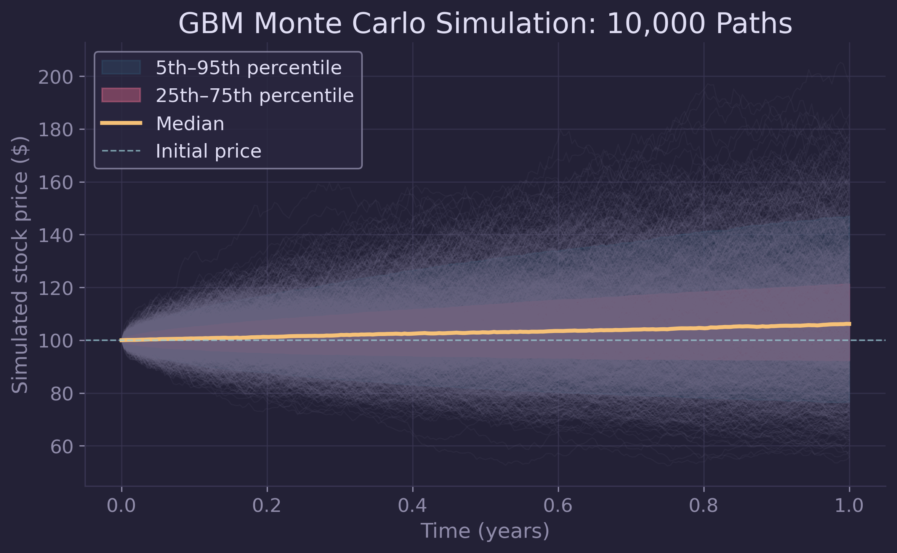
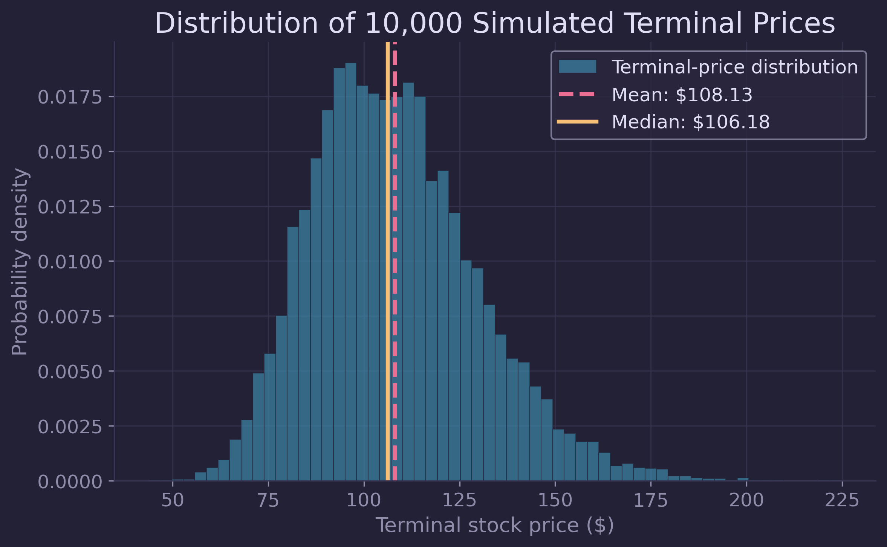
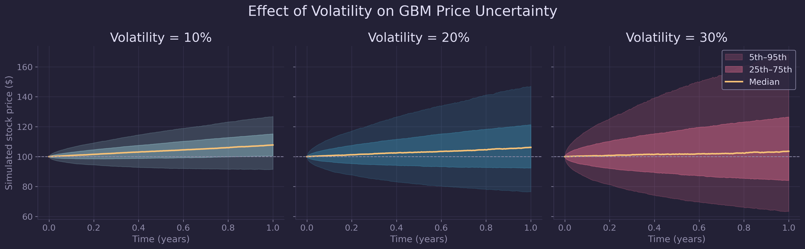

# Monte Carlo Stock-Price Simulation Using GBM

This project uses Monte Carlo simulation to generate possible future stock-price paths under geometric Brownian motion (GBM). The analysis examines how uncertainty develops over time, validates the simulated terminal distribution against analytical GBM results, and investigates how volatility changes the distribution of possible outcomes. The simulations are conditional scenarios based on assumed model parameters.
They are not forecasts of a specific security.



## Key Findings

- 10,000 simulated one-year price paths
- 0.09% error between simulated and analytical expected terminal price
- Exact agreement to two decimals for the theoretical and simulated median
- Terminal standard deviation increased from $10.83 to $33.02 as volatility
  increased from 10% to 30%
- Increasing volatility widened and skewed the distribution without changing
  the theoretical expected terminal price

## Model

Stock prices were modeled using geometric Brownian motion (GBM), a stochastic process in which expected growth and random fluctuations scale with the current asset price:

```math
dS_t = \mu S_t\,dt + \sigma S_t\,dW_t.
```

The variables are:

- `S_t`: stock price at time `t`
- `mu`: assumed annual expected return
- `sigma`: annualized volatility
- `dt`: a small time interval
- `dW_t`: a Brownian-motion increment representing a random market shock

For numerical simulation, the exact discrete-time GBM solution was used:

```math
S_{t+\Delta t}
=
S_t \exp\left[
\left(\mu-\frac{\sigma^2}{2}\right)\Delta t
+
\sigma\sqrt{\Delta t}\,Z
\right],
\qquad
Z\sim\mathcal{N}(0,1).
```

The exponential update models proportional rather than fixed-dollar price changes and guarantees that every simulated price remains positive. Under GBM, terminal prices follow a lognormal distribution. The model therefore produces an asymmetric range of outcomes: prices are bounded below by zero, while the potential upside is theoretically unbounded.

The baseline simulation used an initial price of 100, an assumed annual return of 8%, annual volatility of 20%, and a one-year forecast horizon divided into 252 trading-day intervals.

## Methods

The simulation was implemented in Python using NumPy for numerical calculations and Matplotlib for visualization. A fixed random seed was used to make the simulated results reproducible.

### Single-Path Simulation

A single GBM price path was first generated iteratively to demonstrate how deterministic drift and stochastic shocks combine at each time step. The simulation used an initial price of 100, an assumed annual return of 8%, annual volatility of 20%, and a one-year horizon divided into 252 trading-day intervals.

At every interval, a standard-normal random shock was generated and used to update the previous price according to the discrete-time GBM equation.

### Monte Carlo Simulation

The model was then extended to 10,000 possible one-year price paths. A matrix of independent standard-normal shocks was generated with one row per simulated path and one column per trading-day interval.

Daily log-price increments were accumulated through time using `np.cumsum(..., axis=1)`, where `axis=1` represents the temporal direction within each path. The cumulative log changes were then converted into prices using the exponential GBM solution.

The resulting `price_paths` array had dimensions `(10000, 253)`, representing 10,000 simulated scenarios and 253 recorded prices per scenario, including the initial price at time zero.

### Percentile Bands and Terminal Distribution

At each time point, the 5th, 25th, 50th, 75th, and 95th percentiles were calculated across the 10,000 simulated paths using `axis=0`. These percentiles were used to construct two model-implied scenario bands:

* The 5th-95th percentile band, containing the central 90% of simulated prices
* The 25th-75th percentile band, containing the central 50% of simulated prices

The 50th percentile was plotted as the median simulated trajectory. The terminal prices from all paths were also visualized as a probability-density histogram to examine the lognormal distribution and the difference between its mean and median.

### Analytical Validation

The simulation was validated against the analytical GBM expected terminal price:

```math
\mathbb{E}[S_T] = S_0e^{\mu T}.
```

The theoretical terminal median was calculated as:

```math
\widetilde{S}_T
=
S_0 e^{(\mu-\sigma^2/2)T}.
```

The simulated terminal mean was compared with the analytical expected value using relative error. The simulated terminal median was also compared with its theoretical value.

### Volatility Sensitivity Analysis

To investigate the effect of volatility, the Monte Carlo simulation was repeated using annual volatility values of 10%, 20%, and 30%. The initial price, expected return, forecast horizon, time resolution, and number of simulated paths were held constant.

The same matrix of random shocks was reused across all three volatility scenarios. This common-random-number approach isolated the effect of changing volatility by preventing differences between scenarios from being driven by different random samples.

For each volatility level, the following quantities were compared:

* Terminal mean
* Terminal median
* Terminal standard deviation
* 5th-95th percentile band
* 25th-75th percentile band

The simulation outputs represent conditional scenarios under the selected GBM parameters. They should not be interpreted as confidence intervals or guaranteed forecasts of real market prices.


## Results






## Conclusions and Limitations

The Monte Carlo simulation agreed closely with analytical GBM predictions. For the baseline 20% volatility scenario, the simulated expected terminal price was within 0.1% of the analytical value, while the simulated and theoretical medians both equaled approximately USD 106.18.

The volatility sensitivity experiment demonstrated that increasing annual volatility from 10% to 30% left the expected terminal price approximately unchanged but increased terminal-price standard deviation from USD 10.83 to USD 33.02. Over the same range, the median fell from USD 107.79 to USD 103.56. Higher volatility therefore widened the distribution, increased right skew, and created a larger difference between the typical outcome and the arithmetic mean.

These results are conditional on GBM assumptions, including constant drift and volatility, independent normally distributed log returns, and continuous price paths. Real markets may exhibit jumps, volatility clustering, changing regimes, and heavier tails.


## Running the Notebook

1. Clone the repository
2. Install `numpy` and `matplotlib`
3. Open and run the notebook from top to bottom
